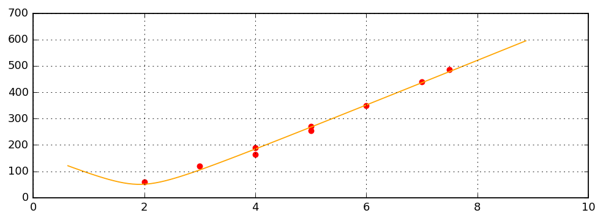
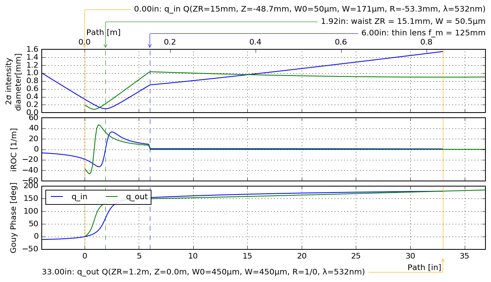
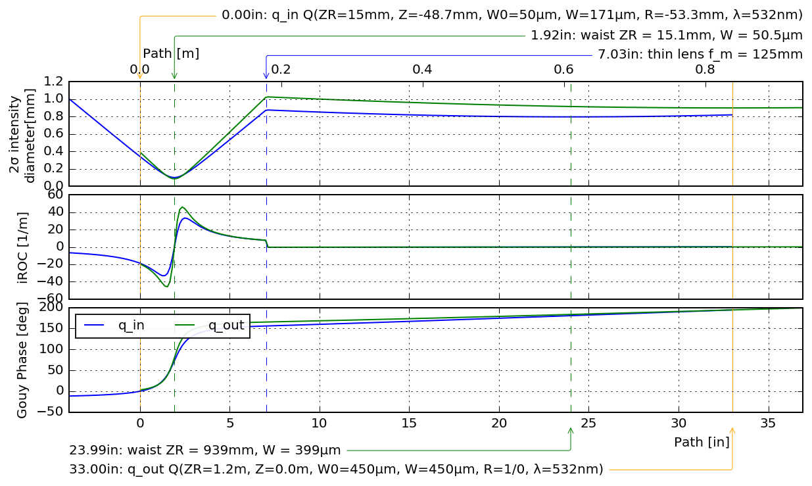
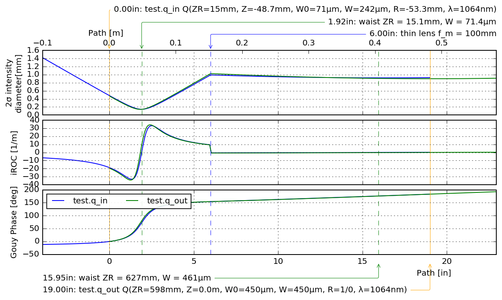

```python
import sys
import numpy as np
import sys
print(sys.version)

from YALL.utilities.ipynb.displays import *
from YALL.utilities.tabulate import tabulate

import declarative

from OpenLoop import alm
from OpenLoop.alm.mplot import MPlotter
#import OpenLoop.alm.fitter as FIT
mplot = MPlotter()

mpl.rc('font', family='DejaVu Sans')
asavefig.org_subfolder = 'gtable'
```

    3.5.3 (default, May 10 2017, 15:05:55) 
    [GCC 6.3.1 20161221 (Red Hat 6.3.1-1)]
    Populating the interactive namespace from numpy and matplotlib


```python
q_PBS = alm.QFit(                                                             
            wavelen_nm = 532.,                                                      
            R_um = np.array([880, 700, 510, 330, 540, 380, 240, 120, 970]) / 2,                                   
            Z_in = [7, 6, 5, 4, 5, 4, 3, 2, 7.5],                                                          
        )  
q_PBS.plot()
```

    /home/mcculler/local/home_sync/projects/OpenLoop/OpenLoop/alm/beam_fit.py:58: RuntimeWarning: invalid value encountered in sqrt
      return (self.wavelen_nm * 1e-9 / (np.pi * z_R) * ((z + z_0)**2 + z_R**2))**.5


    Bunch(
        'ax0' = <matplotlib.axes._subplots.AxesSubplot at 0x7f602497cf98>,
        'ax0_0' = <matplotlib.axes._subplots.AxesSubplot at 0x7f602497cf98>,
        'ax_bottom' = <matplotlib.axes._subplots.AxesSubplot at 0x7f602497cf98>,
        'ax_grid_colrow' = [[<matplotlib.axes._subplots.AxesSubplot at 0x7f602497cf98>]],
        'ax_list' = [<matplotlib.axes._subplots.AxesSubplot at 0x7f602497cf98>],
        'ax_list_0' = [<matplotlib.axes._subplots.AxesSubplot at 0x7f602497cf98>],
        'ax_top' = <matplotlib.axes._subplots.AxesSubplot at 0x7f602497cf98>,
        'fig' = <matplotlib.figure.Figure at 0x7f6017224908>,
        'save' = <function OpenLoop.utilities.mpl.autoniceplot.mplfigB.<locals>.save>,
        )





```python
sys = alm.CRootSystem( 
    env_wavelength_nm = 532,
)

sys.my.q_in = alm.BeamTarget(loc_in = 0, q_raw = q_PBS.q_fit)
sys.my.L1 = alm.CThinLens(loc_in = 6, f_mm = 125)
sys.my.q_out = alm.BeamTarget(loc_in = 33, q_raw = alm.ComplexBeamParam.from_Z_W0(0, 450e-6, wavelen = 532e-9))

ax = mplot.plot('to_fiber', sys.measurements)
sys.measurements.q_target_z(1.42).value
sys.measurements.overlap_seq()
```


    0.22536510561037493





```python
import OpenLoop.fitting.casadi as FIT

fitter = FIT.FitterRoot()
fitter.my.sym = FIT.FitterSym()
fitter.systems.alm = sys
fitter.sym.parameter(sys.L1.loc_in)
#fitter.sym.parameter(sys.q_out.loc_in)

def objective(alm):
    return abs(alm.measurements.overlap('q_in', 'q_out'))**4
print("HEY: ", objective(sys))
fitter.my.overlap = FIT.FitterExpression(
    function = objective,
)
ret = fitter.overlap.minimize_function()
print("OVERLAP: ", objective(ret.systems.alm))
ax = mplot.plot('quickfit', ret.systems.alm.measurements)
```

    HEY:  0.22536510561
    Total number of variables............................:        1
                         variables with only lower bounds:        0
                    variables with lower and upper bounds:        0
                         variables with only upper bounds:        0
    Total number of equality constraints.................:        0
    Total number of inequality constraints...............:        2
            inequality constraints with only lower bounds:        2
       inequality constraints with lower and upper bounds:        0
            inequality constraints with only upper bounds:        0
    
    
    Number of Iterations....: 8
    
                                       (scaled)                 (unscaled)
    Objective...............:  -9.4926496178263331e-01   -9.4926496178263331e-01
    Dual infeasibility......:   2.5579693893970793e-15    2.5579693893970793e-15
    Constraint violation....:   0.0000000000000000e+00    0.0000000000000000e+00
    Complementarity.........:   9.0909090909090923e-17    9.0909090909090923e-17
    Overall NLP error.......:   2.5579693893970793e-15    2.5579693893970793e-15
    
    
    Number of objective function evaluations             = 13
    Number of objective gradient evaluations             = 9
    Number of equality constraint evaluations            = 0
    Number of inequality constraint evaluations          = 13
    Number of equality constraint Jacobian evaluations   = 0
    Number of inequality constraint Jacobian evaluations = 9
    Number of Lagrangian Hessian evaluations             = 9
    Total CPU secs in IPOPT (w/o function evaluations)   =      0.004
    Total CPU secs in NLP function evaluations           =      0.001
    
    EXIT: Search Direction is becoming Too Small.
                       proc           wall      num           mean             mean
                       time           time     evals       proc time        wall time
            nlp_f     0.000 [s]      0.000 [s]    13       0.00 [ms]        0.01 [ms]
            nlp_g     0.000 [s]      0.000 [s]    13       0.00 [ms]        0.00 [ms]
       nlp_grad_f     0.000 [s]      0.000 [s]    10       0.00 [ms]        0.02 [ms]
        nlp_jac_g     0.000 [s]      0.000 [s]    10       0.00 [ms]        0.00 [ms]
       nlp_hess_l     0.000 [s]      0.000 [s]     9       0.00 [ms]        0.03 [ms]
     all previous     0.000 [s]      0.001 [s]
    callback_prep     0.000 [s]      0.000 [s]     9       0.00 [ms]        0.00 [ms]
           solver     0.010 [s]      0.005 [s]
         mainloop     0.010 [s]      0.006 [s]
    OVERLAP:  0.949264961783





```python

class QTest(alm.CSystem):
    @declarative.dproperty
    def q_in(self):
        return alm.BeamTarget(loc_in = 0, q_raw = q_PBS.q_fit)
    @declarative.dproperty
    def L1(self):
        return alm.CThinLens(loc_in = 6, f_mm = 100)
    @declarative.dproperty
    def q_out(self):
        return alm.BeamTarget(loc_in = 19, q_raw = alm.ComplexBeamParam.from_Z_W0(0, 450e-6))

sys = alm.CRootSystem( )
sys.my.test = QTest(loc_in = 0)
ax = mplot.plot('to_fiber', sys.measurements)
sys.measurements.overlap_seq()
```


    0.99093605323198009





```python

```
